<p align="center">
  <picture>
    <source media="(max-width: 760px) and (prefers-color-scheme: dark)" srcset="./assets/hero/agent-console-cdd9bbf6-mobile-dark.svg">
    <source media="(max-width: 760px)" srcset="./assets/hero/agent-console-cdd9bbf6-mobile-light.svg">
    <source media="(prefers-color-scheme: dark)" srcset="./assets/hero/agent-console-cdd9bbf6-dark.svg">
    <source media="(prefers-color-scheme: light)" srcset="./assets/hero/agent-console-cdd9bbf6-light.svg">
    
  </picture>
</p>

<div align="center">

#  Hey, I'm Qazi Farhan Ahmad


<br>


</div>

---

<p align="center">

Team Lead & Full-Stack Engineer @ <b>Saylani Tech Labs</b> building MERN & Next.js web applications with AI integrated where it solves real problems. 25+ applications shipped — e-commerce, management systems, social platforms, and AI-powered products.

<br>

Currently pursuing <b>BS Software Engineering</b> at the <b>University of Peshawar</b> (2024 - 2028) and a graduate of the <b>15-Month Web & Mobile App Development course</b> at <b>Saylani Mass IT Training (SMIT)</b>. Security-first mindset — JWT auth, CSRF protection, rate limiting, and clean architecture.

</p>

---

<div align="center">


</div>

---
## 👨‍💻 About Me

```yaml
Name        : Qazi Farhan Ahmad
Role        : Team Lead & Full-Stack Engineer @ Saylani Tech Labs
Experience  : 25+ web applications shipped
Education   : BS Software Engineering (2024 - 2028) - University of Peshawar
              MERN Stack Web Development (Dec 2024 - Apr 2026) - Saylani Mass IT Training (SMIT)
Location    : Peshawar, Pakistan

Languages   : TypeScript • JavaScript • Python • HTML • CSS

Frontend    : React 19 • Next.js • Vite • Tailwind CSS • shadcn/ui • GSAP • Framer Motion

Backend     : Node.js • Express.js • REST APIs

Databases   : MongoDB • PostgreSQL • Redis • Firebase • Prisma

AI & ML     : Groq LLaMA 3.1 • Jina AI • Google Gemini • OpenAI • Vercel AI SDK • Scikit-learn

Open Source : Liquid Reveal (WebGL npm package) • RAG Chatbot • NOVA E-Commerce

Leadership  : Team Collaboration • Task Distribution • Architecture & Technical Decisions
              • Code Review • From Requirements to Deployment

Interests
 • AI-Powered Web Applications
 • Full-Stack & MERN Development
 • Next.js & TypeScript
 • Real-Time Applications
 • Clean Code & Architecture
 • Open Source
```

<div align="center">


</div>

---


## 🚀 Featured Projects

<p align="center">

<i>Production-grade applications I've built and shipped — live demos and full source included.</i>

</p>

<div align="center">

<table>

<tr>

<td width="50%" style="border:1px solid #30363d;border-radius:10px;padding:14px;background-color:#0d1117">

<h3 align="center">🛒 NOVA — E-Commerce Platform</h3>

<p align="center">

Full-stack MERN eCommerce with OTP auth, Stripe payments, admin analytics, and production-grade security.

</p>

<p align="center">


</p>

<p align="center">
<a href="https://ecommerce-store-one-ochre.vercel.app"></a>
<a href="https://github.com/Qaziaaaa/ecommerce-system"></a>
</p>

</td>

<td width="50%" style="border:1px solid #30363d;border-radius:10px;padding:14px;background-color:#0d1117">

<h3 align="center">🤖 RAG-Chatbot — AI Q&A System</h3>

<p align="center">

MERN-powered RAG chatbot with Groq LLaMA 3.1 streaming responses and Jina AI embeddings for semantic search.

</p>

<p align="center">


</p>

<p align="center">
<a href="https://mydocchat.vercel.app"></a>
<a href="https://github.com/Qaziaaaa/RAG-chatbot"></a>
</p>

</td>

</tr>

<tr>

<td width="50%" style="border:1px solid #30363d;border-radius:10px;padding:14px;background-color:#0d1117">

<h3 align="center">🏨 Hotel Booking System</h3>

<p align="center">

MERN hotel booking platform with AI-enhanced room recommendations, dynamic pricing, smart availability optimization, and role-based access.

</p>

<p align="center">


</p>

<p align="center">
<a href="https://ai-hotel-booking-system.vercel.app"></a>
<a href="https://github.com/Qaziaaaa/Hotel-Booking-System"></a>
</p>

</td>

<td width="50%" style="border:1px solid #30363d;border-radius:10px;padding:14px;background-color:#0d1117">

<h3 align="center">🏥 Medical AI SaaS</h3>

<p align="center">

Healthcare practice management with patient records, AI-powered diagnostic assistance, analytics dashboards, and secure role-based auth.

</p>

<p align="center">


</p>

<p align="center">
<a href="https://medical-ai-saas.vercel.app"></a>
<a href="https://github.com/Qaziaaaa/medical-Ai-saas"></a>
</p>

</td>

</tr>

<tr>

<td width="50%" style="border:1px solid #30363d;border-radius:10px;padding:14px;background-color:#0d1117">

<h3 align="center">📡 Social Media Platform</h3>

<p align="center">

Full-stack social media with news feed, real-time interactions, user profiles, and Docker-based deployment.

</p>

<p align="center">


</p>

<p align="center">
<a href="https://forge-social.vercel.app"></a>
<a href="https://github.com/Qaziaaaa/Social-Media-platform"></a>
</p>

</td>

<td width="50%" style="border:1px solid #30363d;border-radius:10px;padding:14px;background-color:#0d1117">

<h3 align="center">📚 StudyFlow AI</h3>

<p align="center">

AI-powered study productivity platform with smart scheduling, task management, and progress tracking.

</p>

<p align="center">


</p>

<p align="center">
<a href="https://studyflow-ai-three.vercel.app"></a>
<a href="https://github.com/Qaziaaaa/StudyFLow-AI"></a>
</p>

</td>

</tr>

</table>

</div>

### 🌱 More Projects

<p align="center">

| Project | Description | Stack | Links |
|---|---|---|---|
| 🎥 **Video Conferencing App** | Free P2P video meetings — WebRTC, WebSocket signaling, in-call chat | JavaScript · Node.js | [Source](https://github.com/Qaziaaaa/video-conferencing-app) |
| 🎓 **CSS Society UOP** | Official UOP Computing Students Society portal — events, gallery, alumni, certificates | React 19 · TypeScript | [Live](https://cssuop.org) |
| 🌊 **Liquid Reveal** | Zero-dependency WebGL npm package — fluid ripple reveal | WebGL | — |
| 📚 **SMIT Bootcamp LMS** | Dashboards, teams, attendance, tasks & project management — *Team Lead* | MERN · React | — |
| 🧩 **AI Project Planner (BriefKit)** | Turns rough ideas into structured briefs via Groq LLM + ReactFlow | Vite · TypeScript | — |
| 🏠 **dwellosphere** | AI real-estate rental platform — smart property matching & booking | MERN · Stripe | — |
| 🍽️ **Restaurant Management** | Menu, online ordering, table reservations & availability | TypeScript · Express | — |
| 🚀 **QAZI-X** | Futuristic HUD-inspired immersive portfolio | Next.js · React 19 | — |

</p>

<p align="center">

<i>Full project library → <a href="https://qaziahmad.vercel.app/projects">qaziahmad.vercel.app/projects</a></i>

</p>

---

<div align="center">


</div>

## ⚒️ Tech Stack

<div align="center">

### 💻 Languages


<br><br>

### ⚙️ Frontend


<br><br>

### 🖥️ Backend & Database


<br><br>

### ☁️ DevOps & Tools


<br><br>

### 🤖 AI Stack


<br><br>

### 🛠️ AI Tools


</div>

---

## 📊 GitHub Stats

<div align="center">





<br><br>


</div>

---

<div align="center">


</div>

<div align="center">


</div>

---

<div align="center">


</div>

<div align="center">


</div>

---

<div align="center">


</div>

<div align="center">


</div>

---

<div align="center">


</div>

<div align="center">
  <picture>
    <source media="(prefers-color-scheme: dark)" srcset="https://raw.githubusercontent.com/Qaziaaaa/Qaziaaaa/output/github-snake-dark.svg"/>
    <source media="(prefers-color-scheme: light)" srcset="https://raw.githubusercontent.com/Qaziaaaa/Qaziaaaa/output/github-snake.svg"/>
    
  </picture>
</div>

---

## 📜 Certifications

<p align="center">

| Certification | Issuer | Year |
|---|---|---|
| **Google AI Essentials Specialization** | Google | 2026 |
| **Discover the Art of Prompt Engineering** | Google | 2026 |
| **Web & Mobile App Development (15-Month)** | Saylani Mass IT Training (SMIT) | 2024 - 2026 |
| **Intro to Machine Learning** | Kaggle | 2026 |
| **Soft Skills Workshop** | Pakistan Software Export Board (PSEB) | - |

</p>

---

<div align="center">


</div>

<div align="center">

<a href="https://qaziahmad.vercel.app">

</a>

<a href="https://www.linkedin.com/in/qazi-farhan-ahmad/">

</a>

<a href="mailto:qazithekingston@gmail.com">

</a>

<a href="https://wa.me/923141935787">

</a>

<a href="https://github.com/Qaziaaaa">

</a>

</div>

---

## 💼 Work Experience

<p align="center">

| Role | Company | Period | Scope |
|---|---|---|---|
| **Full-Stack Engineer & Team Lead** | **Saylani Tech Labs** (Internship) | Jul 2026 - Present | On-site, Peshawar |
| **MERN Stack Team Lead** | **Ads Results 24/7** (Internship) | May 2026 - Present | Remote, Lahore |
| **Core Team Member** | **Computing Students Society** | Feb 2026 - Present | Hybrid, Peshawar |
| **Freelance Web Developer** | **Digital Dream Web and Graphic** | Jan 2025 - Present | Remote |

</p>

- 🧑‍💼 **Full-Stack Engineer & Team Lead** — *Saylani Tech Labs* (Jul 2026 - Present)
  → Leading team collaboration, task distribution, and development workflow
  → Building and integrating full-stack features across frontend and backend
  → Contributing to system architecture, technical decisions, and problem-solving
  → Managing project progress from requirements through development, testing, and deployment
- 🚀 **MERN Stack Team Lead** — *Ads Results 24/7* (May 2026 - Present)
  → Leading a small MERN stack team on live client deliverables
  → Owning sprint scope and code review; shipping features on schedule
- 🎓 **Core Team Member** — *Computing Students Society* (Feb 2026 - Present)
  → Built and shipped the CSS Society UOP Portal (<a href="https://cssuop.org">cssuop.org</a>) as part of a student dev team — frontend ownership from wireframe to deployment
- 💼 **Freelance Web Developer** — *Digital Dream Web and Graphic* (Jan 2025 - Present)
  → Delivering client websites end-to-end on the React/MERN stack and integrating AI-based features into builds

---
